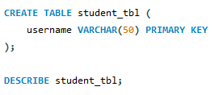
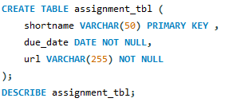
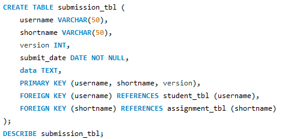
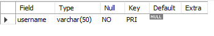
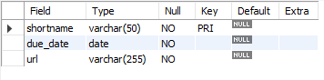
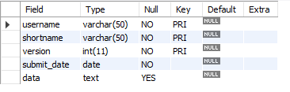
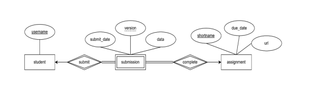
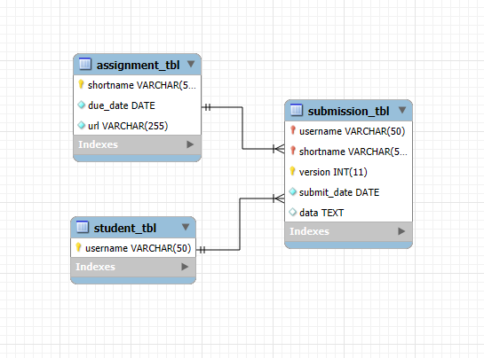

# Finals Lab Task 2. Transforming ER Model to Relational Tables
In this activity, it convert the ER diagram that shows student assignment submissions into a MySQL database and
define the relationships between students and record all entities and their properties concentrating on 
assignments and submissions. Also with using primary keys and foreign keys in order to determine the foreign and primary keys and make sure they are
portrayal of any weak or reliant entities.

These are the following data types of the attributes for the table and diagram:

* student table:  
username: String (VARCHAR), up to 50 characters.

* assignment table:  
shortname: String (VARCHAR), up to 50 characters.
due date: Date, cannot be null.
url: String (VARCHAR), up to 255 characters, can be null.

* submission table:  
username: String (VARCHAR), up to 50 characters.
shortname: String (VARCHAR), up to 50 characters.
version: Integer, represents the version of the submission.
submit date: Date, cannot be null.
data: Text.
Note: Create the appropriate table relationship and enforce necessary REFERENTIAL INTEGRITY CONSTRAINTS (Primary Keys and Foreign Keys)

## Query Statements:
**Step 1: Student Table:**  
Primary Key: username  
Relation - One to Many  

**Step 2: Assignment Table:**  
Primary Key: shortname  
Relation - One to Many  

**Step 3: Submission Table:**  
Primary Key: username, shortname, version  
Relation - Many to One  

## Table Structures:
**Table 1: Student Table**  

**Table 2: Assignment Table**  

**Table 3: Submission Table**  

## Entity Relational Schema
* Attached iamge of the diagram below:
  

## Entity Relationship Diagram 
* Attached image of the diagram below:  

